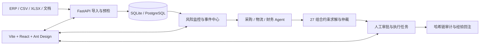
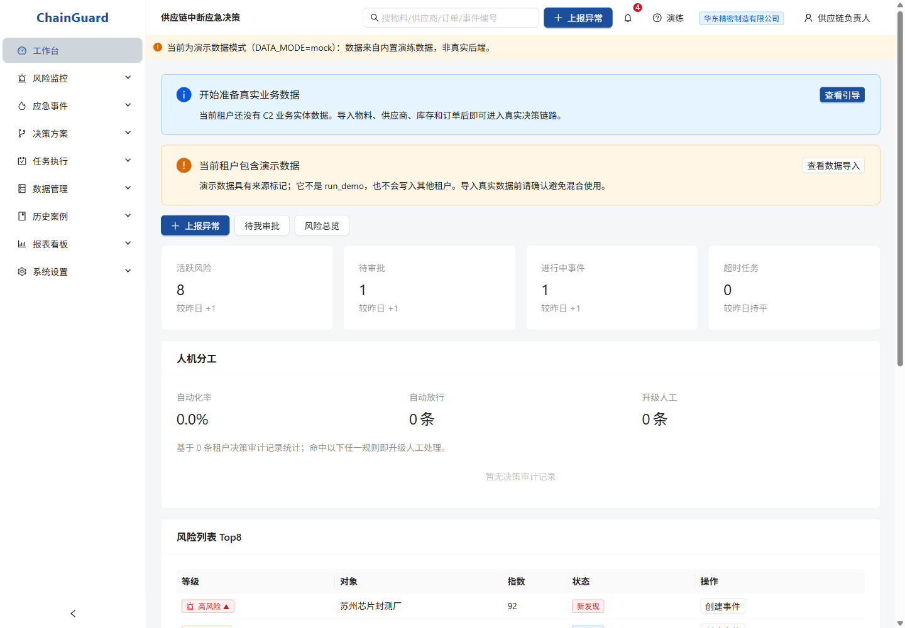
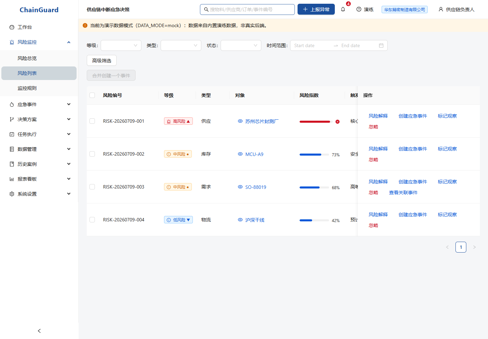
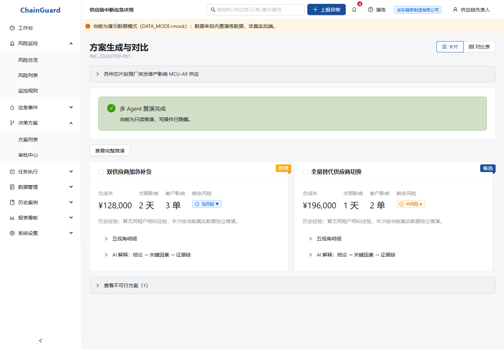

# ChainGuard - 供应链中断应急决策系统

ChainGuard 面向制造企业，把风险发现、多角色方案生成、约束仲裁、人工审批、任务执行和审计追溯连接成一条可复算的决策链。风险指数、约束判断和方案排序由确定性代码完成；可选大模型只组织解释文本，不参与数值计算或替代人工审批。

> 权属依学校或赛事约定。本仓库未授予任何开源许可；未经权利人书面许可，不得复制、分发、修改或用于商业用途。

## 系统架构



## 产品界面

| 工作台 | 风险监控 | 决策推演 |
| --- | --- | --- |
|  |  |  |

截图使用固定合成演示数据，不包含真实企业、个人或密钥信息。

## 核心能力

- 双轨风险监控：专家绝对红线与数据分布相对离群线取严；样本不足时明确回退。
- 可解释多 Agent 决策：采购、物流、财务分别提案，穷举 3 × 3 × 3 组合并展示硬约束淘汰原因。
- 人工责任边界：高风险与未收敛方案进入审批，审批完成后才拆解执行任务。
- 多租户权限：后端权限码驱动菜单、路由、按钮、字段脱敏和数据范围。
- 可追溯数据链：导入预检、审批、敏感字段访问和关键动作均进入审计链。
- 可复现实验：基准指标、收益权重敏感性和技术说明 PDF 均由仓库脚本生成。

## 一键运行

需要 Python 3.13+ 与 Node.js 20.19+（或 22.12+）。演示默认使用 SQLite，无需额外数据库服务。

```powershell
# Windows
.\start-demo.ps1
```

```bash
# macOS / Linux
./start-demo.sh
```

脚本会安装依赖、执行 Alembic 迁移、播种固定演示数据、构建前端并由 FastAPI 在单端口托管 `dist/`。完成后访问 `http://127.0.0.1:8000`。

演示账号为 `admin@chainguard.demo`、`boss@chainguard.demo`、`scm_lead@chainguard.demo` 等九种角色，统一密码 `Demo@2026`。这些凭据仅适用于本地合成演示环境。

开发时可分别启动：

```powershell
# 终端 1
Set-Location ChainGuard
python -m uvicorn src.api:app --port 8000

# 终端 2
Set-Location chainguard-web
$env:PORT=8001
$env:DATA_MODE='api'
npm run dev
```

## 复现与验证

```powershell
# 决策基准
Set-Location ChainGuard
python -c "from src.benchmark import run_baseline; print(run_baseline())"

# 固定种子的收益权重敏感性实验
python scripts/run_payoff_sensitivity.py --output docs/experiments/payoff-sensitivity.json

# 技术说明 PDF（构建日期取 SOURCE_DATE_EPOCH 或源文件最近提交日期）
Set-Location ..
python tools/build_tech_doc_pdf.py
```

```powershell
# 后端
Set-Location ChainGuard
ruff check .
pytest -q
pip-audit -r requirements.txt -r requirements-dev.txt

# 前端
Set-Location ..\chainguard-web
npm run typecheck
npm test
npm run build
npm audit --audit-level=low
npm audit --omit=dev --audit-level=low
```

本次导师评审整理的本地验证基线：后端 863 passed / 5 skipped；前端原有 79 个测试全部迁移通过，并新增 CSV 安全导出测试；TypeScript、生产构建和两种 npm 审计均通过。GitHub Actions 仍是最终合入门禁，以远端 `main` 的实际运行结果为准。

## 目录与文档

| 路径 | 内容 |
| --- | --- |
| `ChainGuard/src/` | 决策内核与 FastAPI Web API |
| `ChainGuard/alembic/` | SQLite / PostgreSQL 数据库迁移 |
| `ChainGuard/config/` | 风险阈值、效用权重等可调参数 |
| `ChainGuard/scripts/` | 演示数据、敏感性实验、备份恢复脚本 |
| `chainguard-web/` | Vite + React + React Router + Ant Design 前端 |
| `ChainGuard/docs/技术方案说明书.md` | 架构、实测、限制和落地路径 |
| `ChainGuard/docs/demo_video_operation_script.md` | 可逐镜头验证的演示操作脚本 |
| `ChainGuard/docs/experiments/payoff-sensitivity.md` | 收益权重敏感性实验说明 |

## 能力边界与开发透明度

- 仓库数据均为固定种子生成的合成演示数据，不代表真实企业效果。
- 当前性能结果是特定硬件和数据规模下的测试，不能外推为生产 SLA。
- SQLite 适合本地演示；生产路径以 PostgreSQL、外部密钥管理、备份恢复和监控告警为前提。
- 浏览器不解析不可信 XLSX；XLSX 上传由后端 `openpyxl` 处理，客户端下载产物统一为 UTF-8 BOM CSV。
- 项目开发使用了 AI 编程工具协作；相关 `Co-Authored-By` 信息保留在提交记录中，最终设计、验证与发布责任由项目维护者承担。
- 暂不展示未经赛事全称、年份、奖项和团队归属材料核验的获奖声明。

完整接口和部署说明见 [技术方案说明书](ChainGuard/docs/技术方案说明书.md)、[本地上手指南](ChainGuard/docs/local_walkthrough.md) 与 [部署指南](ChainGuard/docs/deploy_guide.md)。
